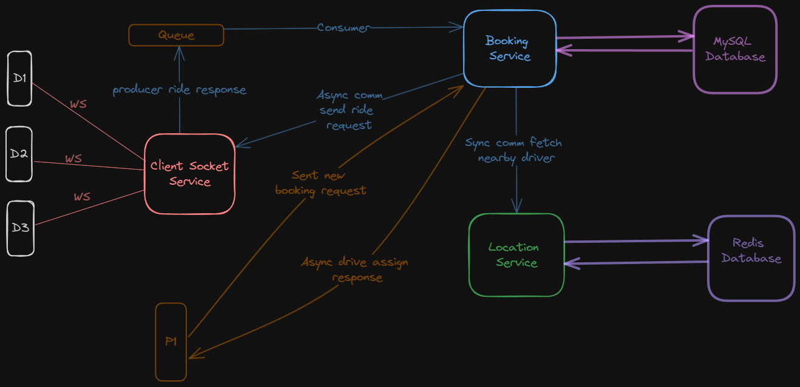

# Uber Backend 

## Overview 
* Developed Uber Backend using a microservice architecture. This project contains six different microservices.

* #### Booking Service:
    * Allowed passengers to book rides, once a ride request is get all nearby drivers using Location Service. Then after 
      notify all nearby drivers.
* #### ClientWebSocket:
  * This service manages all WebSocket connections with drive to handle real time data. 
* #### Location Service: 
  * To efficiently handle location-based data, incorporate Redis server. It handles driver location data.
* #### Entity Service: 
  * This centralizes model service. It contains all required model classes. 

## Pre requisite 
* To run this project on your machine, you need to install ```Java 17, MySQL Database and Redis server```. Run each microservice separately. 

## High level diagram 
